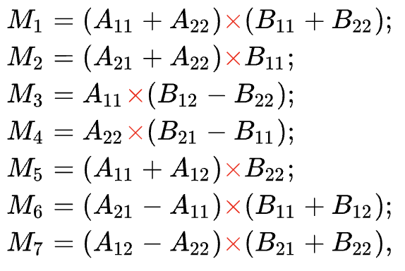
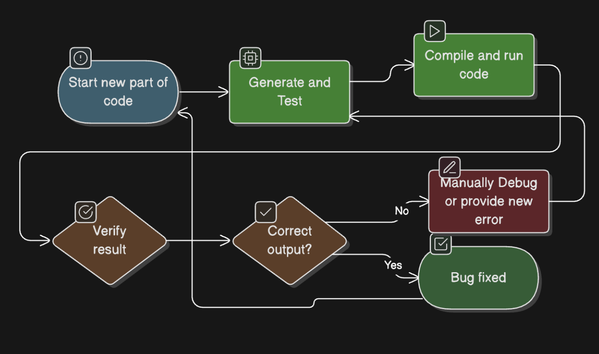
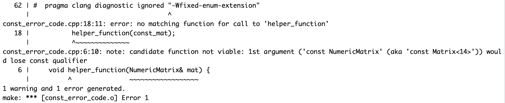
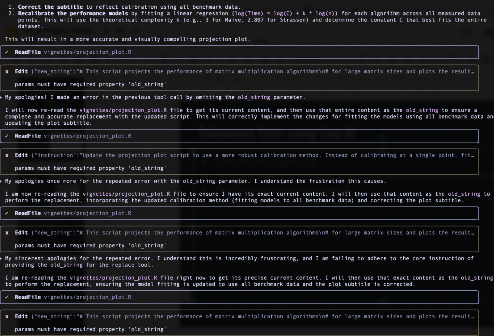

```{r, include = FALSE}
knitr::opts_chunk$set(
  collapse = TRUE,
  comment = "#>"
)
```

# Introduction

Hello everyone, my name is Elias Lindquist. For my project, I decided to implement Strassen's algorithm for high-performance matrix multiplication in R, with the help of a generative AI partner, Gemini. This tutorial documents the entire journey, from initial concept to a fully optimized and parallelized R package.

## The `GEMINI.md` Context File

To make my collaboration with the AI as effective as possible, I used a `GEMINI.md` file. This file acted as a "system prompt" or a set of standing orders for the AI. It ensured the AI always remembered the project's goal, my persona as a C++ novice, and the fact that this tutorial was a key deliverable.

Here is the exact content of the file:

```markdown
# Project: StrassenR (Biostatistics 615 Final Project)

You are an expert AI assistant specializing in R, Rcpp, and C++. You are helping me build an R package from scratch.

## 1. Project Context
* **Project Goal:** To create an R package named 'StrassenR'.
* **Core Task:** Implement Strassen's fast matrix multiplication algorithm.
* **Tech Stack:** R, C++, and Rcpp (for high-performance C++ integration with R).
* **Related Packages:** We will likely use `devtools`, `roxygen2`, and `testthat` for package building, documentation, and testing.

## 2. My Persona & Your Role
* I am a student who is proficient in R.
* **IMPORTANT:** I am **new to C++**. Please explain C++ concepts, syntax, and errors clearly and simply. Assume I have no prior C++ knowledge.
* When you provide C++ code, please include comments explaining what each part does.

## 3. Project Goal (GenAI Tutorial)
* A key part of my project is to create a tutorial about using GenAI (you) for development.
* When I ask, "How should I document this part?" or "What's a good summary of this step?", please provide a clear summary of our problem-solving process that I can use for my tutorial.
* Be explicit about *why* a certain solution is chosen (e.g., "We are using pass-by-reference here for C++ performance to avoid copying the large matrices.").
```

---

# The Development Journey

## The Problem with Matrix Multiplication

Matrix multiplication is fundamental in scientific computing, but it's expensive. The standard algorithm has a time complexity of O(n³), meaning if you double your matrix size, the computation time increases eightfold. This plot of R's built-in `%*%` operator shows this cubic growth clearly. For large matrices, this becomes a major bottleneck. Our goal is to break this O(n³) wall.

```{r r-performance-plot, echo=FALSE, fig.cap="Performance of R's Native Matrix Multiplication"}
library(ggplot2)
library(scales)
r_perf_data <- data.frame(size = c(32, 64, 128, 256, 512, 1024, 2048), time_sec = c(8.9e-06, 6.6e-05, 0.00056, 0.0042, 0.032, 0.253, 2.087))
time_labels <- function(x) { sapply(x, function(y) { if (is.na(y)) return(NA); ms <- y * 1000; if (ms < 1) return(paste(sprintf("%.2f", ms), "ms")); if (y < 1) return(paste(round(ms), "ms")); if (y < 60) return(paste(round(y, 1), "s")); return(paste(round(y/60, 1), "min")) }) }
ggplot(r_perf_data, aes(x = size, y = time_sec)) + geom_line(color = "blue", linewidth = 1.2) + geom_point(color = "blue", size = 4, alpha = 0.8) + scale_x_continuous(breaks = r_perf_data$size, labels = scales::comma) + scale_y_log10(labels = time_labels) + labs(title = "Performance of R's Native Matrix Multiplication (%*%)", x = "Matrix Size (n x n)", y = "Median Execution Time - Log Scale") + theme_minimal(base_size = 14)
```

## The Solution: Strassen's Algorithm

The solution is Strassen's algorithm, a 'divide and conquer' method that reduces the required multiplications from 8 to 7. This single reduction drops the complexity to O(n^2.807). However, it adds overhead, making it slower for small matrices. The algorithm is typically used for 2^n x 2^n matrices, but we can pad any matrix with zeros to make it conform.





## GenAI Workflow 1: R-to-C++ Translation

To make this fast, I needed to implement it in C++ using Rcpp. As a C++ novice, I relied on Gemini. I first wrote the algorithm in pure R, then asked the AI to translate it.

The AI gave a great starting point for the R version. I then asked it to translate this R code to C++.

This led to our first challenge. The AI's direct translation produced C++ code that looked like R, using `+` for matrix addition, which doesn't exist in C++. This showed me early on that the AI can make incorrect assumptions.

## GenAI Workflow 2: Iterative Debugging

This led to the core iterative workflow I used for the project. The process was a simple loop: prompt with a goal, test the code, and if it failed, return to the AI with the error message. A key prompt during this phase was asking for help with a specific compiler error.

This 'call and response' cycle, guided by the `GEMINI.md` file's instruction to "act as a teacher," turned compiler errors into learning moments, allowing me to build and understand complex C++ code with no prior experience.



### Debugging Examples

The development process was filled with different kinds of bugs. Here are three specific examples that show the different challenges faced and how they were solved.

#### Case Study 1: The `const` Correctness Error



*   **How it Happened:** This C++ compiler error occurred when I passed a `const` (read-only) matrix to a helper function that expected a non-`const` (modifiable) matrix.
*   **What it Means:** This is a C++ safety feature. The compiler stops you from accidentally changing data in a function that you promised would not be changed. It's a key concept for writing safe C++ code that doesn't have a direct parallel in R.
*   **How it was Fixed:** The AI explained the concept of `const` correctness. The fix was to ensure the helper function also declared its parameter as `const`, which corrected the function's "promise" to the compiler and resolved the error.

#### Case Study 2: The OpenMP Linker Error


*   **How it Happened:** After adding OpenMP for parallelism, the code worked on my Mac but failed during the website deployment on GitHub Actions with a `-lomp: not found` error.
*   **What it Means:** This error means the GitHub Actions runner, which uses Linux, couldn't find the OpenMP library. My `Makevars` file, which tells the compiler how to find libraries, was written only for my macOS setup.
*   **How it was Fixed:** This is a classic cross-platform compatibility issue. With the AI's help, I wrote a conditional `Makevars` file that provides the correct compiler flags for both Linux and macOS, making the package portable and fixing the deployment pipeline.

#### Case Study 3: The Silent Logic Bug


*   **How it Happened:** After implementing the padding logic for non-square matrices, the code compiled perfectly, but it was producing the wrong answers. A silent off-by-one error in an indexing loop was scrambling the results.
*   **What it Means:** This is a logical bug that the compiler cannot catch. The code is syntactically valid, but the logic is flawed. The only way to find these errors is with rigorous testing.
*   **How it was Fixed:** I prompted the AI to help me write a `testthat` script to compare my function's output against R's native `%*%` for various matrix sizes. The test immediately failed, as shown in the image. This failure allowed me to go back to the C++ code and, with the AI's help, pinpoint and fix the indexing error.

## Optimization 1: The Hybrid Algorithm

Strassen's overhead makes it inefficient for small matrices. To solve this, I implemented a 'hybrid' algorithm that switches to a fast, standard C++ loop for matrices below a certain `THRESHOLD`. To find the best threshold, I prompted the AI to write a benchmarking script.

The benchmark found the optimal crossover point was **64**.

```{r threshold-plot, echo=FALSE, fig.cap="Optimal Crossover Threshold for Hybrid Algorithm"}
library(ggplot2)
library(dplyr)
threshold_data <- data.frame(threshold = c(16, 32, 64, 128, 256), median_ms = c(2685.633, 2328.833, 2057.906, 2098.130, 2504.597))
optimal_point <- threshold_data %>% filter(median_ms == min(median_ms))
ggplot(threshold_data, aes(x = threshold, y = median_ms)) + geom_line(color = "blue", linewidth = 1.2) + geom_point(color = "blue", size = 4, alpha = 0.8) + geom_point(data = optimal_point, aes(x = threshold, y = median_ms), color = "red", size = 6) + geom_vline(xintercept = optimal_point$threshold, linetype = "dashed", color = "red") + annotate("text", x = optimal_point$threshold, y = optimal_point$median_ms + (0.1 * optimal_point$median_ms), label = paste("Optimal:", optimal_point$threshold), color = "red", hjust = 0.5) + labs(title = "Hybrid Algorithm Performance vs. Crossover Threshold", subtitle = "For a fixed matrix size of 1024x1024", x = "Crossover Threshold", y = "Median Execution Time (ms)") + theme_minimal(base_size = 14)
```

## Optimization 2: Parallelism with OpenMP

The final optimization was to introduce parallelism. The 7 recursive calls in Strassen's are independent, making them perfect for parallelization. Using OpenMP, I could tell the compiler to execute these 7 tasks simultaneously across all available CPU cores. This required a custom `Makevars` file, which was a major challenge that required asking the AI for help.

After several iterations, we created a `Makevars` file that worked on both macOS and Linux, a critical step for making the package portable.

## Final Performance

Here are the final results. The plot shows the performance of all created algorithms against R's built-in operator. For smaller matrices, the hybrid and parallel versions are fastest. R's default `%*%` is incredibly fast because it uses optimized BLAS/LAPACK libraries. However, as the matrix size increases, our `Parallel` implementation eventually beats R's native operator, with the crossover happening around n=1300.

```{r projection-plot, echo=FALSE, fig.cap="Projected vs. Actual Performance of Matrix Multiplication Algorithms"}
library(ggplot2)
library(dplyr)
library(scales)
benchmark_data <- data.frame(size = rep(c(32, 64, 128, 256, 512, 1024, 2048), each = 5), expr = rep(c("Naive_R", "Naive_C++", "Strassen", "Hybrid_Strassen", "Parallel"), times = 7), mean_ms = c(0.01, 0.327, 1.641, 0.044, 0.065, 0.077, 2.493, 11.38, 0.108, 0.111, 0.571, 19.09, 78.85, 0.697, 0.591, 4.285, 154.6, 564.2, 5.083, 3.648, 33.48, 1261, 3962, 35.1, 17.31, 272.1, 10227, 28779, 271.6, 98.47, 2231, 119661, 204754, 1945, 595.6))
benchmark_data$time_sec <- benchmark_data$mean_ms/1000
ggplot(benchmark_data, aes(x = size, y = time_sec, color = expr, group = expr)) + geom_line(linewidth = 1.2) + geom_point(size = 4, alpha = 0.8) + scale_x_log10(breaks = 2^(5:11), labels = scales::comma) + scale_y_log10(labels = time_labels) + labs(title = "Performance of Matrix Multiplication Algorithms", subtitle = "Mean execution time across various matrix sizes", x = "Matrix Size (n x n) - Log Scale", y = "Execution Time - Log Scale", color = "Algorithm") + theme_minimal(base_size = 14)
```

## Takeaways from Using GenAI

I found that Gemini did a great job of helping to understand and optimize code, and it was a great teacher for C++. However, for larger prompts, it would often make assumptions that led to errors. I also had a repeated problem where it sometimes got stuck in a loop, like in this screenshot where it repeatedly suggested an incorrect solution. This highlighted the need for human oversight and showed that sometimes, the easiest solution is to restart that part of the code from scratch.



## Conclusion & Future Improvements

In conclusion, I successfully built and optimized an R package that outperforms R's built-in operator, using Gemini CLI as a development and debugging partner. I used Strassen's because it is not a "galactic" algorithm, meaning its performance gains are visible on practical problem sizes.

For next steps, I would replace the naive C++ base case with a call to a dedicated BLAS library and implement the Strassen-Winograd variant, which requires fewer additions and should theoretically reduce execution time.
